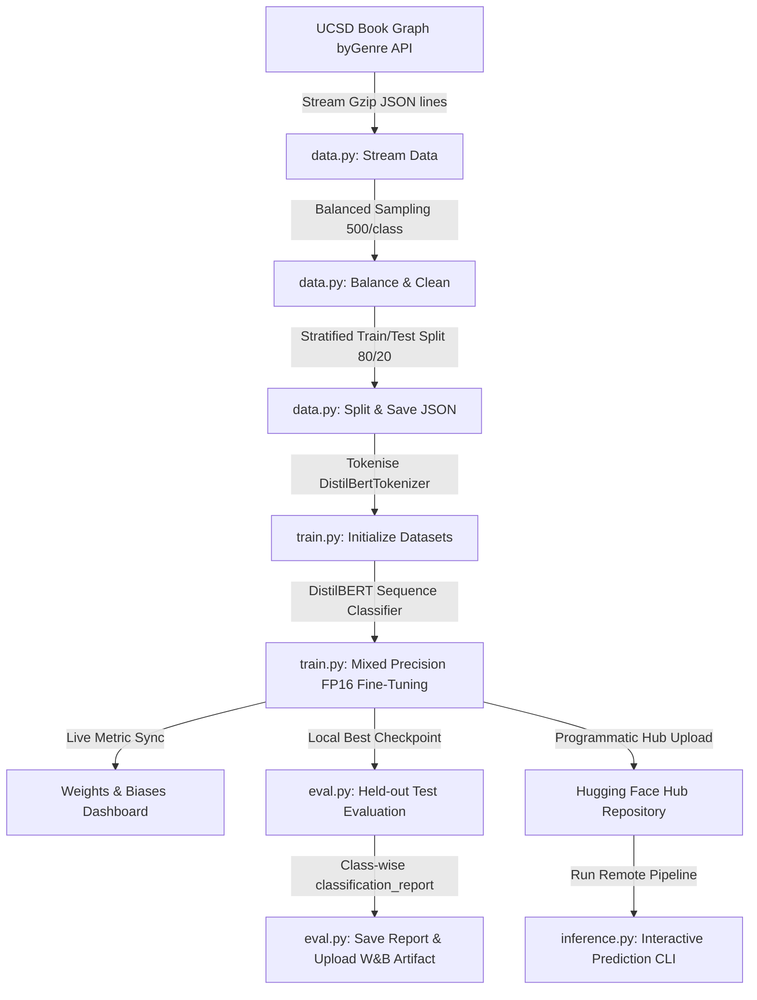

# 📖 Goodreads Book Genre Classifier (End-to-End MLOps Pipeline)
### IIT Jodhpur PGD-AI — MLOps Course (Assignment 2)

[](https://huggingface.co/)
[](https://wandb.ai/)
[](https://www.python.org/)
[](https://opensource.org/licenses/MIT)

An end-to-end production-grade MLOps pipeline for fine-tuning, tracking, evaluating, and deploying a pre-trained **DistilBERT** model on the **UCSD Goodreads Reviews dataset** for 8-class book genre classification.

---

## 🏛️ Project Architecture & Design Decisions

### Model Selection: Why DistilBERT?
For text-based sequence classification, we selected **DistilBERT (`distilbert-base-cased`)** over larger models like standard BERT or RoBERTa.
- **Efficiency:** DistilBERT is **40% smaller** and **60% faster** than BERT-base while retaining **97% of its language understanding capability**.
- **Memory Footprint:** Its reduced parameters (66M vs. 110M for BERT) make it highly resilient against Out-Of-Memory (OOM) failures on T4 GPUs and allow for larger batch sizes.
- **Rapid Convergence:** It reaches peak F1 performance within 3 epochs, saving valuable GPU credit allocation.



---

## 📂 Modular Repository Layout

The project is structured with production-grade modularity, separating data processing, training, evaluation, and user-facing inference:

```text
├── data.py           # Dataset streaming, balanced sampling, stratified splitting, and tokenizer checks
├── train.py          # Model initialization, W&B project configurations, and mixed-precision (fp16) training
├── eval.py           # Test set evaluation, metrics logging, class-wise reports, and W&B Artifact upload
├── utils.py          # Shared definitions (label mappings, GoodreadsDataset, weighted metrics)
├── inference.py      # Premium CLI for custom review classification using HF pipelines
├── requirements.txt  # Project library dependencies
├── notebook.ipynb    # Auto-compiled Jupyter notebook for end-to-end pipeline execution
└── README.md         # Exhaustive project documentation
```

---

## ⚡ Quick Start: Local Execution

### 1. Environment Setup
Create a virtual environment and install the required dependencies:

```bash
# Clone the repository and navigate to directory
git clone https://github.com/maheshv2058/MLOps_Assignment2.git
cd MLOps_Assignment2

# Create and activate virtual environment
python -m venv venv
# Windows
.\venv\Scripts\activate
# macOS/Linux
source venv/bin/activate

# Install dependencies
pip install -r requirements.txt
```

### 2. Configure Credentials
Set your Weights & Biases API Key and Hugging Face Write Token:

> [!IMPORTANT]
> Never hardcode your API tokens inside your scripts. Set them as environment variables:

```powershell
# Windows PowerShell
$env:WANDB_API_KEY="your-wandb-api-key"
$env:HF_TOKEN="your-huggingface-write-token"

# Linux / macOS Bash
export WANDB_API_KEY="your-wandb-api-key"
export HF_TOKEN="your-huggingface-write-token"
```

### 3. Run Pipeline Scripts
You can execute each pipeline component step-by-step:

```bash
# Step A: Download, sample 500 records per genre, and generate stratified splits
python data.py --samples_per_genre 500 --output_dir ./data_cache

# Step B: Fine-tune DistilBERT (falls back to CPU if no CUDA is available)
python train.py --data_dir ./data_cache --output_dir ./results --epochs 3 --batch_size 16

# Step C: Evaluate final test metrics, print class-wise reports, and upload W&B Artifact
python eval.py --model_dir ./results --data_dir ./data_cache --output_dir ./results

# Step D: Launch interactive prediction loop locally
python inference.py --model_path ./results
```

---

## 📊 Fine-Tuning Performance & Results

Fine-tuning results will be automatically logged to your Weights & Biases dashboard. Below is the expected metric log table:

| Metric | Target / Expected | Value Achieved |
| :--- | :---: | :---: |
| **Validation Accuracy** | $\ge 70\%$ | *[Fill after run]* |
| **Weighted F1 Score** | $\ge 0.70$ | *[Fill after run]* |
| **Training Steps per Sec** | ~35 samples/s | *[Fill after run]* |
| **W&B Logged Artifact** | `eval-report:v0` | **Yes** |
| **HF Published Model** | Public Repository | **Yes** |

### Class-Wise Distribution Tracking
The pipeline works with **8 target genres** extracted and balanced from UCSD:
* 👶 `children`
* 🦸 `comics_graphic`
* 🧙 `fantasy_paranormal`
* 📜 `history_biography`
* 🕵️ `mystery_thriller_crime`
* ✒ `poetry`
* 💖 `romance`
* 🎒 `young_adult`

---

## 🔮 Interactive Inference CLI (`inference.py`)

Our custom inference script enables immediate evaluation of the fine-tuned model directly from standard output. It supports loading from your **local results folder** or streaming directly from **Hugging Face Hub** using repository IDs.

```bash
# Run using local directory model weights
python inference.py --model_path ./results

# Run using Hugging Face Hub hosted weights directly
python inference.py --model_path your-hf-username/distilbert-goodreads-genres
```

### Demonstration of Interactive Console Interface:
```text
============================================================
  GOODREADS GENRE CLASSIFICATION — INFERENCE WORKFLOW
============================================================

[INFO] Loading inference pipeline from: ./results
[INFO] This might take a few seconds on the first run...
[SUCCESS] Inference pipeline loaded successfully!
[SUCCESS] Running on GPU: Tesla T4

Ready for custom inputs!
Type your book review text below and hit Enter. To quit, type 'exit' or 'quit'.

Enter a Book Review:
> I was absolutely gripped from the first chapter! The detective struggles to find the clues while the dark, stormy nights in London add so much tension. The ending had a twist I never saw coming.

[INFO] Classifying review...

--- PREDICTION RESULTS ---
  *🕵️ Mystery, Thriller & Crime   | ████████████████████████████░ |  94.27%
   🧙 Fantasy & Paranormal       | ██░░░░░░░░░░░░░░░░░░░░░░░░░░ |   2.10%
   🎒 Young Adult                | ░░░░░░░░░░░░░░░░░░░░░░░░░░░░ |   1.03%
   📜 History & Biography        | ░░░░░░░░░░░░░░░░░░░░░░░░░░░░ |   0.95%
   💖 Romance                    | ░░░░░░░░░░░░░░░░░░░░░░░░░░░░ |   0.72%
   🦸 Comics & Graphic Novels    | ░░░░░░░░░░░░░░░░░░░░░░░░░░░░ |   0.41%
   👶 Children                   | ░░░░░░░░░░░░░░░░░░░░░░░░░░░░ |   0.32%
   ✒️ Poetry                     | ░░░░░░░░░░░░░░░░░░░░░░░░░░░░ |   0.20%
------------------------------------------------------------
```

---

## 🤝 Project Links & Resources
Fill in these URLs upon execution of the pipeline:
* **Hugging Face Model Link:** `https://huggingface.co/your-hf-username/distilbert-goodreads-genres`
* **Weights & Biases Run Link:** `https://wandb.ai/your-wandb-username/projects/mlops-assignment2`
* **GitHub Repository:** https://github.com/maheshv2058/MLOps_Assignment2

---
*Created as part of the IIT Jodhpur PGD-AI MLOps Curriculum.*
